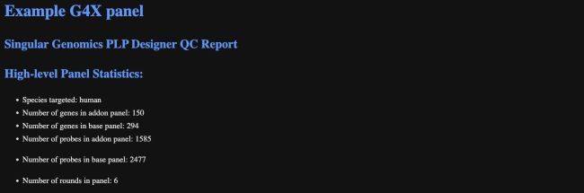
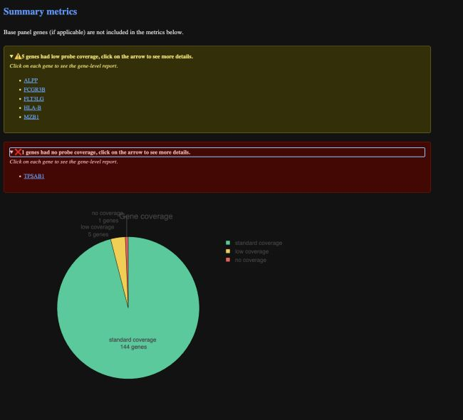
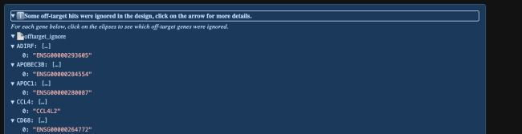
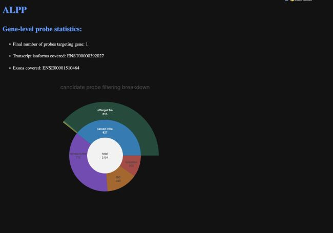
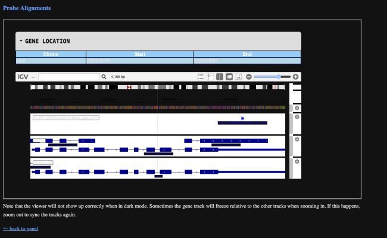

 

# Panel QC report guide

---

A panel QC report summarizes the results of a custom G4X panel design. It contains panel-level statistics, gene-coverage results, and links to interactive reports for individual genes.

!!! note "Report contents vary"

    Not every panel QC report contains every section described in this guide. Sections appear only when they apply to the panel design. For example, a report for a panel without a base panel will not include base-panel statistics or a base-panel gene list.

## Open the report

The report is delivered as a ZIP archive. Extract the complete archive before opening the report; the HTML pages use relative links to the included scripts, gene reports, and other supporting files.

1. Extract the report ZIP archive to a folder on your computer.
2. Keep the extracted directory structure intact.
3. Open `plp_designer_report.html` in Google Chrome.

Use the following operating-system-specific steps to extract and open the report:

- **macOS:** In Finder, double-click the ZIP archive. Open the extracted folder, then Control-click `plp_designer_report.html` and select **Open With > Google Chrome**.
- **Windows:** In File Explorer, right-click the ZIP archive and select **Extract All**. Open the extracted folder, then right-click `plp_designer_report.html` and select **Open with > Google Chrome**.
- **Linux:** In your file manager, right-click the ZIP archive and select **Extract Here** or **Extract To**. Open the extracted folder, then right-click `plp_designer_report.html` and open it with Google Chrome or Chromium.

The top-level HTML file links to the final gene-list CSV and to the contents of the `genes/` directory. Moving individual files out of the extracted folder can break those links or prevent interactive visualizations from loading.

!!! tip

    If the report was opened directly from inside the ZIP archive, close it, extract the entire archive, and open the extracted `plp_designer_report.html` file instead.

## Panel summary

### Custom panel statistics

The **High-level Panel Statistics** section identifies the targeted species and summarizes the numbers of genes, probes, and imaging rounds in the custom panel design. When a base panel is included, the report lists base-panel and add-on-panel counts separately.

### Design results and final gene list

The **Design Results** section gives general context for the probe-selection process. Use **Download final gene list CSV** to save a compact table containing all genes in the custom panel and, when present, the base panel. The CSV also lists the Ensembl gene ID and final probe count for each gene.

### Summary metrics

The summary metrics assign each panel gene to a standard-, low-, or no-coverage category. Base-panel genes, when present, are not included in this summary. Expand the low- and no-coverage notices to see the affected genes, then select a gene name to open its gene-level report.

The gene-coverage chart shows the number and percentage of panel genes in each coverage category.

### Off-target ignores

When ignore genes were included in the panel design, the summary contains an expandable tab titled **Some off-target hits were ignored in the design**. Expand this drop-down menu to view the genes included in the custom off-target ignore list, presented as each target gene and its allowed off-target hits. Allowing an off-target hit means that, during the design process, probe hits to the listed off-target gene were ignored for the corresponding target gene.

!!! tip

    This section is panel-specific and appears only when the design includes off-target ignores. It is separate from the default reference exceptions described below.

!!! note "Report-version differences"

    Older panel QC reports may contain layouts or features that are no longer current. The `offtarget_ignore` mapping described here is also used in current reports when ignore genes are included in the design.

### Reference exceptions

When present, **Alt scaffold ignores (Singular default)** lists reference-level exceptions for genes requested in the design. These entries are reported separately from any panel-specific off-target ignore policy.

### Gene-level reports

The **Gene-level reports** section links to a separate interactive page for every add-on gene. Each gene page can include:

- the final number of probes targeting the gene;
- the covered transcript isoforms and exons;
- a filtering chart summarizing how candidate probes progressed through design filters;
- an expandable table of predicted off-target hits for candidate probes that did not pass filtering; and
- an interactive probe-alignment view.

Use **back to panel** at the bottom of a gene report to return to the panel summary.

### Base-panel gene list

If the design includes a base panel, its genes are listed near the bottom of the report. This list provides context for the combined panel but is separate from the add-on gene-level reports and summary metrics.

 

--8<-- "_core/_partials/end_cap.md"
