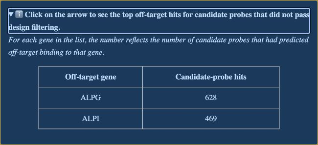

 

# Panel QC report guide

---

A panel QC report summarizes the results of a custom G4X panel design. It contains panel-level statistics, gene-coverage results, and links to interactive reports for individual genes.

!!! note "Report Contents Vary"

    Not every panel QC report contains every section described in this guide. Sections appear only when they apply to the panel design. For example, a report for a panel without a base panel will not include base-panel statistics or a base-panel gene list.

## Opening your Panel QC Report

The report is delivered as a ZIP archive, typically through `files.com` from the `transfers@singulargenomics.com` email address. Once you have downloaded the file, extract the complete archive before opening the report. The HTML pages must remain in their original extracted directory structure for the hyperlinks to function properly.

Use the following operating-system-specific steps to extract and open the report:

- **macOS:** In Finder, double-click the ZIP archive. This opens Archive Utility, the default extraction tool on macOS. Open the extracted folder, then Control-click `plp_designer_report.html` and select **Open With > Google Chrome**.
- **Windows:** In File Explorer, right-click the ZIP archive and select **Extract All**. Open the extracted folder, then right-click `plp_designer_report.html` and select **Open with > Google Chrome**.
- **Linux:** In your file manager, right-click the ZIP archive and select **Extract Here** or **Extract To**. Open the extracted folder, then right-click `plp_designer_report.html` and open it with Google Chrome or Chromium.

!!! warning

    The top-level HTML file links to the final gene-list CSV and to the contents of the `genes/` directory. Moving individual files out of the extracted folder can break those links or prevent interactive visualizations from loading.

## How to use this report
---

You can use this report in two ways:

1. To get a quick, high-level understanding of how your panel performed. This review focuses on the [panel statistics](#high-level-panel-statistics) and [summary](#summary-metrics) sections of the report.
2. To explore important genes or genes with low or no coverage in greater detail and understand where candidate probes align and how they were selected. Most of this information is in the [gene-level](#gene-level-reports) section of the report.

Most requested genes are typically designed with standard coverage. For these genes, design changes are generally not recommended, and the genes are expected to perform well in the G4X assay. In these cases, further review beyond the report landing page is typically unnecessary.

If there are genes with low or no coverage, you will typically have two ways to address them. First, you can contact the Singular Genomics team to replace a low- or no-coverage gene with an alternative gene. Alternatively, if the gene is important to your work and cannot be removed from the panel, you can work with the Singular Genomics team to evaluate potential off-target allowances that may increase the likelihood of identifying suitable probes.

This process is often iterative. You identify one or more acceptable off-target genes, Singular Genomics reruns the panel design, and the updated results are reviewed with you. If coverage does not improve sufficiently, additional off-target allowances may be considered.

For each gene for which you want to consider off-target allowances, open the gene-level report and review the hits listed in the [off-target gene hits](#off-target-gene-hits) section. Identify any off-target hits that may be acceptable for probes targeting that gene. Singular Genomics recommends confirming that the off-target gene either shares a functional role with your intended gene in the tissue or is expressed at a sufficiently low level that you do not expect meaningful signal from it.

!!! warning
    While off-target allowances often result in more probes, some genes are part of large gene families with extremely high homology and will likely not be resolved with only one or two allowances. For example, IgG1, IgG2, IgG3, and IgG4 may require a solution such as a pan-IgG targeting probe instead of probes targeting one or two family members.

## Panel Contents
---

### High-level Panel Statistics

 

The **High-level Panel Statistics** section identifies the targeted species and summarizes the numbers of genes, probes, and imaging rounds in your custom panel design. When a base panel is included, the report lists base-panel and add-on-panel counts separately.

You can also select **Download final gene list CSV** to save a compact table containing the gene symbols, Ensembl IDs, and number of probes per gene for all genes in the custom panel and, when present, the base panel.

### Summary metrics

The summary metrics section assigns each panel gene to a standard coverage (4 or more probes), low coverage (1 to 3 probes), or no coverage (0 probes) category. Base-panel genes, when present, are not included in this summary. Expand the low-coverage and no-coverage notices to see the affected genes, then select a gene name to open its gene-level report.

The associated pie chart shows a visual representation of the number and percentage of panel genes in each coverage category. An example of this section of the report is shown below.

### Off-target exceptions

This section lists exceptions made for off-target comparisons during the design process. Allowing an off-target hit to a specific gene means that probe hits to the listed off-target gene were ignored for the corresponding target gene.

For example, probes targeting `IgG1` may be rejected because of high sequence homology with `IgG2`. This information is available in the [gene-level reports](#gene-level-reports). If `IgG2` is expected to have low expression in the intended samples or has a sufficiently similar functional role in the tissue, the customer may decide, in consultation with Singular Genomics, to allow off-target hits to `IgG2` for probes targeting `IgG1`. The resulting probes may detect either `IgG1` or `IgG2`. Singular Genomics marks ambiguous probes in the output data. The customer should determine whether this ambiguity is acceptable for the intended application and account for it during downstream analysis.

!!! note

    The customer off-target ignore section is typically not present unless you have iterated on the design with the Singular Genomics team.

- `Customer Off-Target Ignores`
    During the iteration process for a gene panel, customer feedback may result in selected off-target allowances. When this occurs, the summary contains an expandable section titled **Some off-target hits were ignored in the design**. Expanding this section shows the genes in the custom off-target ignore list, with each target gene and its allowed off-target transcript hits.

- `Singular Off-Target Ignores`
    All panel designs include an **Alt scaffold ignores (Singular default)** section that lists the relevant default allowances for off-target hits between genes and their alternative scaffolds in common references. Expanding this section shows each target gene and its allowed off-target transcript hits.

### Gene-level reports

The **Gene-level reports** section links to a separate interactive page for every add-on gene. Each gene page can include:

- the final number of probes targeting the gene.
- the covered transcript isoforms and exons.
- a filtering chart summarizing how candidate probes progressed through the design filters.
- an expandable table of predicted off-target hits for candidate probes that did not pass filtering.
- an interactive probe-alignment view.

Use **back to panel** at the bottom of a gene report to return to the panel summary.

 

#### Interactive filtering pie chart

The interactive pie chart allows you to explore how many candidate probes were filtered out at each stage of the design. This multilevel view reflects the two stages of the panel design process: candidate generation and pooling.

!!! tip "Passed final does not mean included"

    Probes listed as **passed final** are not necessarily used in the design. Some may overlap with one another or conflict with other probes in your panel. This value only indicates how many candidate probes passed all hard filters applied during the design analysis.

#### Off-target gene hits

The **off-target hits** drop-down menu is located below the candidate probe filtering plot. Expand this section to view the top predicted off-target genes for candidate probes that did not pass design filtering. The **Off-target gene** column lists the genes where off-target binding was predicted. The **Candidate-probe hits** column reports the number of candidate probes with a predicted hit to each gene.

This information can help you identify off-target allowances that may be acceptable for an important low- or no-coverage gene. These counts describe candidate probes that were filtered during the design process. They do not show the number of probes included in the final panel.
 

#### IGV viewer probe alignment

The embedded IGV viewer allows you to view where probes are predicted to bind relative to the exons of the target gene. All isoforms are listed on the lowest tracks to provide a clear view of predicted probe binding. You can pan and zoom within the plot.

!!! tip "Misaligned Probes/Exons"
    Some tracks in this plot may contain scroll bars on the far right. If no visible intron aligns with a probe location, the probe may target an exon that is farther down in the scrollable track.

### Base-panel gene list

If the design includes a base panel, its genes are listed near the bottom of the report. This list provides context for the combined panel but is separate from the add-on gene-level reports and summary metrics.

 

--8<-- "_core/_partials/end_cap.md"
