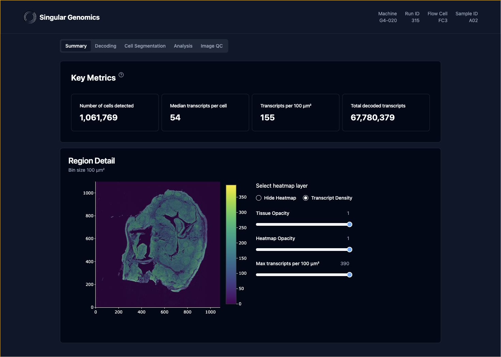
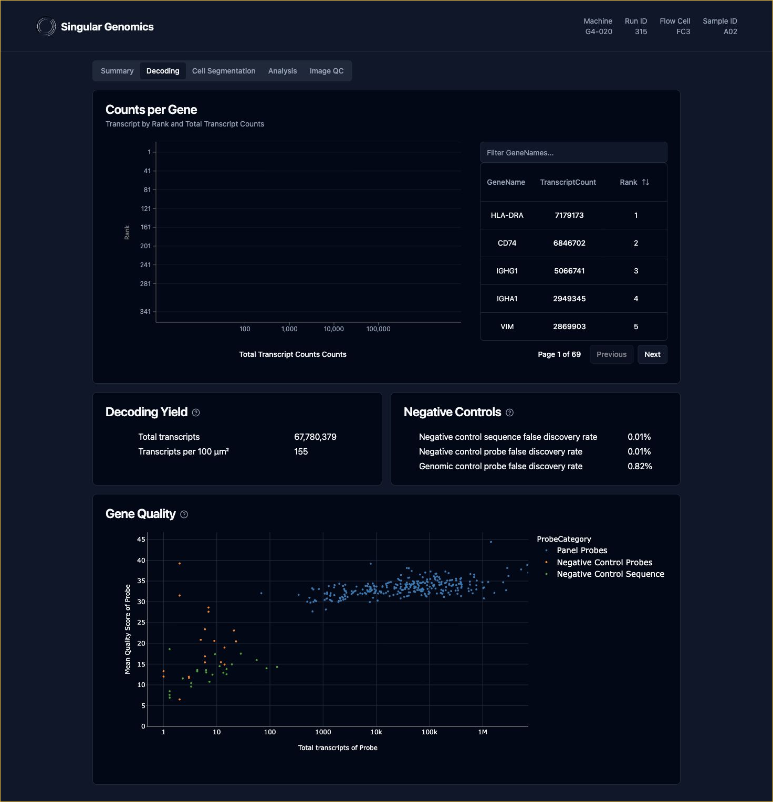
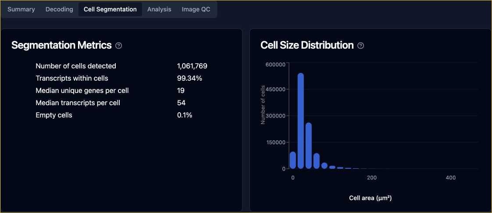
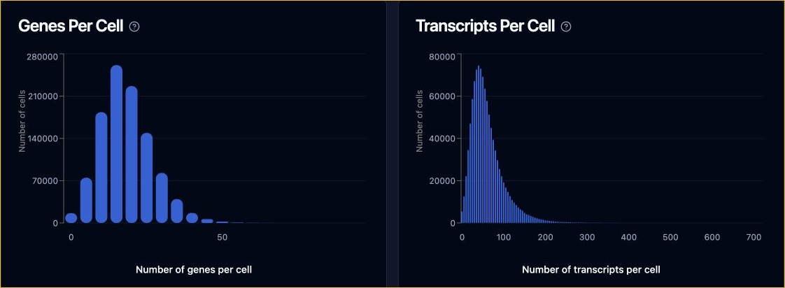
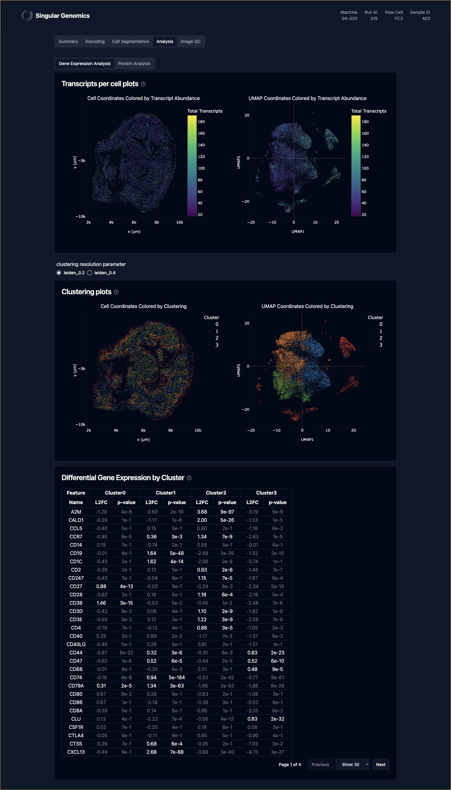
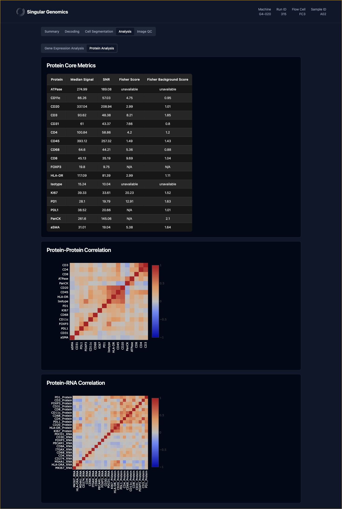
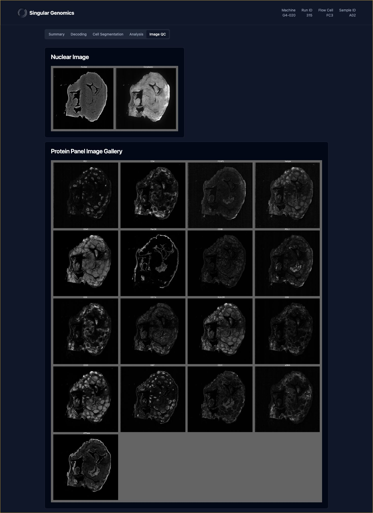

 

# G4X sample summary report guide

---

The G4X sample summary report provides a high-level overview of the experiment output, data quality, and performance for an individual sample. It brings together run identifiers, decoding and segmentation metrics, exploratory analysis results, and image-quality views in a single interactive HTML file.

!!! note "Report contents vary"

    The available sections depend on the assay and on which analysis outputs were generated. For example, protein metrics, protein-correlation plots, and the protein image gallery appear only when protein data are available.

## Opening your sample summary report

---

The report is named `summary_{sample_id}.html` and is located in the root of the [G4X output directory](../../g4x_data/output_structure.md). For example, the report for sample `A02` is named `summary_A02.html`.

You can open the report in either of the following ways:

1. Open the HTML file directly from the output directory. On macOS, Control-click the file and select **Open With > Google Chrome**. On Windows, right-click the file and select **Open with > Google Chrome**. On Linux, open the file with Google Chrome or Chromium.
2. Open the sample in G4X-viewer, select **View G4X Summary Report**, and use **Open in new tab** if you want the report in a separate browser tab. This option is available only for datasets produced in the Zarr format and may not appear for older outputs.

!!! tip

    If the report opens in G4X-viewer, you can review it without navigating away from the current viewer session.

## How to use this report

---

Use this report as a starting point for basic quality control (QC) of your G4X data. Its sections provide complementary information, and not every section applies to every sample.

1. Start with **Summary** for the sample identifiers, headline metrics, and spatial distribution of decoded transcripts.
2. Use **Decoding** to review transcript detection, controls, and probe-level quality.
3. Use **Cell Segmentation** to review the segmentation performance and determine if the cell area and transcript distributions match your expectations.
4. Use **Analysis** to review automated spatial and UMAP visualizations, clustering results, and differential gene expression generated for the sample. These results are intended for initial QC rather than publication-ready analysis.
5. Use **Image QC** to inspect the nuclear and cytoplasmic images and, when available, the protein image gallery.

!!! note "Is my data good?"

    This guide explains where to find each result and what the displayed values describe. It does not assign universal pass/fail thresholds because appropriate criteria depend on the panel, block, and sample. Evaluate data quality by considering whether the results recover the expected cell types and tissue structure alongside the relevant error rates. Median transcripts per cell is informative, but it is not sufficient by itself to determine whether a dataset is suitable for downstream analysis.

## Report contents

---

The report header appears on every tab and identifies the instrument used to generate the data, the run ID, the flow cell number, and the sample ID. Use these values to confirm that you are reviewing the intended sample before interpreting the results.

The report contains a set of tabs with run information and basic analyses. Use these tabs to move between the sections described below.

- [Summary](#summary)
- [Decoding](#decoding)
- [Cell Segmentation](#cell-segmentation)
- [Analysis](#analysis)
- [Image QC](#image-qc)

 

### Summary

---

The **Summary** tab contains the **Key Metrics** and **Region Detail** sections.

#### Key Metrics

The **Key Metrics** section provides the following sample-level overview:

- **Number of cells detected:** Reports the number of segmented cells in the sample.
- **Median transcripts per cell:** Reports the median decoded-transcript count across cells.
- **Transcripts per 100 µm²:** Normalizes the decoded-transcript count by tissue area. This value can vary substantially by sample type.
- **Total decoded transcripts:** Reports the total number of decoded transcripts in the sample.

#### Region Detail

The **Region Detail** section provides an interactive spatial view that overlays transcript density on the tissue image using 100 µm² bins. You can hide or show the heatmap, change the tissue and heatmap opacity, and adjust the maximum value used for the heatmap scale. These controls can make lower-density spatial patterns easier to inspect.

### Decoding

---

The **Decoding** tab summarizes transcript counts and probe-level decoding results. Use it to review transcript detection, controls, and probe-level quality. The following image shows a typical report.

#### Counts per Gene plot

The **Counts per Gene** plot shows each gene by its total decoded-transcript count and transcript-count rank. Hover over a point to display its gene name, rank, and abundance in the sample. The associated table lists the gene name, transcript count, and rank. Use the gene-name filter to locate an individual target.

#### Decoding Yield

The **Decoding Yield** section reports the total number of decoded transcripts and the number of transcripts per 100 µm².

#### Negative Controls

The **Negative Controls** section reports false-discovery rates (FDR) for negative control sequences (NCS), negative control probes (NCP), and genomic control probes (GCP). These values provide context for nonspecific or unexpected signal in the decoded data.

<!-- Add a link here when the G4X controls reference page is created. Recommended target: ../../g4x_data/g4x_controls.md -->

!!! note "Expected FDRs"

    NCP and NCS FDR values are generally expected to be below 0.5%, while GCP FDR values are generally expected to be below 5%. Interpret these values in the context of transcript abundance because samples with very low transcript counts can show inflated FDR values.

#### Gene Quality plot

The **Gene Quality** plot compares the total transcript count for each probe with its mean probe quality score. The plot distinguishes panel probes from negative-control probes and sequences, allowing you to compare count and quality patterns across probe categories.

This plot can help identify probes whose quality and abundance patterns approach those of the controls. Typically, NCS have low quality and low abundance, NCP have moderate quality and low abundance, and panel probes have both high quality and high abundance. Panel probes that appear near the NCS or NCP may warrant further review before downstream analysis. However, low-abundance transcripts found only in rare cell types can also appear near the controls when plotted across the entire sample, so interpret these patterns using the biological context of the sample.

### Cell Segmentation

---

The **Cell Segmentation** tab summarizes how decoded transcripts were assigned to segmented cells. Use this section to review segmentation performance and identify potential anomalies. The following image shows a typical report.

#### Segmentation Metrics

The **Segmentation Metrics** section reports:

- the number of cells detected;
- the percentage of transcripts within cells;
- the median number of unique genes per cell;
- the median number of transcripts per cell; and
- the percentage of empty cells.

#### Segmentation Plots

This section displays three histograms showing the distributions of **Cell Size**, **Genes Per Cell**, and **Transcripts Per Cell**. Distribution shapes can vary with tissue and cell-type composition and do not need to be normally distributed. Unexpected modes or large numbers of cells with low transcript counts may reflect biological subpopulations or segmentation artifacts, such as oversegmentation in necrotic or adipose tissue regions. Review these plots together with the tissue images before drawing conclusions.

### Analysis

---

The **Analysis** tab contains **Gene Expression Analysis** and, for multiomics runs, **Protein Analysis**. Use these automated results to determine whether a basic analysis captures key spatial features during initial QC; they are not intended as publication-ready analyses.

#### Gene Expression Analysis

**Gene Expression Analysis** presents basic dimensionality-reduction and clustering results from the transcript data. Use these results to determine whether the automated analysis captures expected spatial features.

The **Transcripts per cell plots** show cells in spatial coordinates and UMAP coordinates, colored by transcript abundance. The report subsets these displays to 5,000 cells for interactive usability.

The **Clustering plots** show the same spatial and UMAP views colored by cluster assignment. The automated analysis applies minimal filtering to remove obvious outliers before PCA, Leiden clustering, and UMAP embedding. When multiple clustering resolutions are present, use the clustering-resolution selector to choose which result to display.

The **Differential Gene Expression by Cluster** section lists genes associated with each cluster in the lowest-resolution Leiden clustering result. Use these results to determine whether key spatial clusters are associated with expected marker genes. Navigate the table using the **Next** and **Previous** buttons.

#### Protein Analysis

For multiomics samples, **Protein Analysis** includes a table of protein core metrics and correlation heatmaps for protein-to-protein and protein-to-RNA measurements.

The **Protein Core Metrics** section describes high-level statistics for each protein included in the protein panel:

- **Median Signal:** The median pixel intensity of the on-tissue protein image.
- **SNR:** The signal-to-noise ratio calculated using the on-tissue signal and off-tissue background.
- **Fisher Score:** The Fisher's exact test score for co-occurrence between a protein signal and its corresponding RNA target. Not every protein has a corresponding RNA target in the gene panel.
- **Fisher Background Score:** The Fisher's exact test score for co-occurrence between a protein signal and 25 randomly selected RNA targets.

The **Protein-Protein Correlation** plot shows the spatial correlation between each pair of on-tissue protein signal channels. Use it to review similarities and differences among protein signal patterns.

The **Protein-RNA Correlation** plot shows the spatial correlation between each of a set of protein signal channels and their associated transcripts. This is useful to determine whether the transcripts and protein signals colocalize as expected in key cell types.

### Image QC

---

The **Image QC** tab provides whole-sample image views for a visual review of tissue coverage and image quality.

#### Nuclear image

The nuclear and cytoplasmic views provide complementary structural context for the tissue. Inspect the full tissue footprint for clipping, missing regions, debris, uneven intensity, or other spatial artifacts that may warrant follow-up investigation.

#### Protein panel image gallery

For multiomics samples, the **Protein Panel Image Gallery** displays an overview image for each protein target and control included in the report. Compare the spatial signal patterns across targets and note channels with unexpected background, saturation, or limited tissue signal.

 

--8<-- "_core/_partials/end_cap.md"
